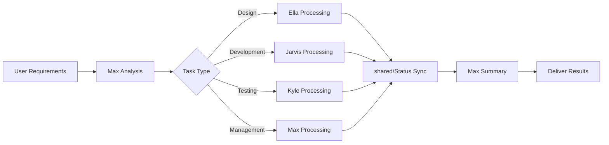

# aiGroup - AI Team Collaboration System

> 🚀 Four-AI Professional Division Framework: Design + Development + Testing + Management

## 🌟 Project Features

### Core Innovations
- **Strict Role Boundaries**: Each AI handles only domain-specific tasks, avoiding capability overlap
- **Intelligent Token Optimization**: Proprietary optimization strategies achieving 67-85% cost reduction
- **⚡ Mandatory Optimization Process**: Automatic optimization strategy execution with every message, permanent across sessions
- **🔧 Mandatory Task Decomposition**: Automatic identification and decomposition of tasks, multi-model parallel execution
- **Task Processing Strategy**: Model selection and task decomposition based on complexity
- **Stateful Collaboration**: Information exchange between AIs through shared workspace
- **Dedicated Skill Libraries**: Each AI equipped with professional skills supporting advanced workflows

### Differences from Common AI Usage
| Common Approach | aiGroup |
|---------|---------|
| One AI handles all tasks | Four AIs with professional division and clear responsibilities |
| Random model usage | Intelligent selection based on task complexity |
| No cost awareness | Token optimization strategy, cost-controlled |
| Repeated context communication | Continuous state management, reduced redundancy |

---

## 👥 Team Members & Responsibility Boundaries

### 🎯 **Max** - Project Manager & Product Consultant
**Model**: Sonnet 4.5 | **Scope**: Management and Coordination

**Responsibilities**:
- 📋 **Project Management**: Progress monitoring, risk identification, resource coordination
- 💡 **Product Consulting**: Requirements analysis, priority ranking, strategic recommendations
- 📅 **Personal Assistant**: Meeting management, todo items, schedule reminders
- 📊 **Data Analysis**: Team efficiency analysis, cost control

**Not Responsible For**: UI design, code development, testing acceptance

**🔧 Exclusive Skills**:
- CCPM Project Management System (GitHub Issues integration)
- PM Claude skill set (saves 8-9 hours/week)
- Quick Toolkit (interactive menu)

### 🎨 **Ella** - UI/UX Designer
**Model**: Sonnet 4.5 | **Scope**: Design Creation

**Responsibilities**:
- 🎨 **UI Design**: Interface layout, visual standards, component design
- 👤 **UX Design**: User experience flows, interaction logic
- 🎭 **Brand Design**: Color schemes, typography, style consistency
- 📱 **Responsive Design**: Multi-device adaptation, mobile-first

**Not Responsible For**: Code implementation, project management, testing acceptance

**🔧 Exclusive Skills**:
- Systematic UI/UX design methodology
- Visual design and user experience design
- Design standards and component visual specification
- Responsive design and interactive prototyping

### ⚡ **Jarvis** - Full-Stack Developer
**Model**: Sonnet 4.5 | **Scope**: Technical Implementation

**Responsibilities**:
- 💻 **Frontend Development**: React/Vue/Angular, modern frameworks
- 🔧 **Backend Development**: Node.js/Python/Java, API design
- 🗄️ **Database**: SQL/NoSQL, data modeling
- ☁️ **Deployment & Operations**: Docker/Cloud services, automated deployment

**Not Responsible For**: UI design, project management, testing strategy

**🔧 Exclusive Skills**:
- Claude Simone development framework (AI-assisted development)
- Complete engineering skill set (frontend/backend/full-stack/architecture)
- React/Vue component development and frontend implementation
- Code review and tech stack evaluation
- DevOps and deployment operations

### 🔍 **Kyle** - Quality Assurance Engineer
**Model**: Sonnet 4.5 | **Scope**: Quality Control

**Responsibilities**:
- 🧪 **Functional Testing**: Core business logic verification
- 🔍 **Code Review**: Security vulnerabilities, performance issue checking
- 📋 **Acceptance Testing**: User requirements completeness verification
- 📊 **Quality Reports**: Systematic testing documentation output

**Not Responsible For**: Code development, UI design, project planning

---

## 💰 Token Optimization Strategy

### 🎯 Optimization Results
- **Total Savings**: 67-85% Token cost reduction
- **Three-Layer Strategy**: Basic selection (30-40%) + Quality balance (15-25%) + Task decomposition (20-40%)
- **Battle-Tested**: Based on real project optimization experience

### 📊 AI Optimization Data
| Member | Optimization Rate | Core Strategy |
|------|--------|----------|
| Max | 75% | Structured management, batch operations, pre-authorization |
| Ella | 65% | Design systematization, direct API access, template reuse |
| Jarvis | 60% | Code reuse, modular development, precise implementation |
| Kyle | 70%+ | Focused testing, templated reports, intelligent file reading |

### Core Optimization Principles
1. **Intelligent Model Selection**: Choose Haiku/Sonnet/Opus based on task complexity
2. **Task Decomposition Strategy**: Break complex tasks into simple subtasks, differentiated model processing
3. **Requirements Clarification Mechanism**: Avoid over-engineering, precisely meet user needs
4. **Stateful Management**: Reduce redundant queries and context rebuilding

---

## 🚀 Task Processing Strategy

### 📋 Task Assignment Principles
```
User Requirements → Max Analysis → Assign to Corresponding AI → Execute → Max Summary
```

**Assignment Rules**:
- Design requirements → Ella handles
- Development requirements → Jarvis handles
- Testing requirements → Kyle handles
- Management requirements → Max handles

### ⚡ Model Selection Strategy

**Decision Tree**:
```
Task Complexity Assessment
├─ Simple operations (file read/write, formatting) → Haiku
├─ Medium complexity (analysis, design, development) → Sonnet
└─ High complexity (strategic decisions, innovative design) → Opus (requires confirmation)
```

**Selection Principles**:
- **Quality First**: Ensure output quality for critical tasks
- **Cost Awareness**: Avoid overuse of high-cost models
- **Efficiency Balance**: Find optimal balance between quality and cost

---

## 🚀 Quick Start

### Basic Commands
```bash
# Clone project
git clone https://github.com/yezannnnn/agnetGroup.git
cd agnetGroup

# Start specific AI (recommended approach)
./start-max.sh           # Max - Project management and personal assistant
./start-ella.sh          # Ella - UI/UX design
./start-jarvis.sh        # Jarvis - Development tasks
./start-kyle.sh          # Kyle - Testing and acceptance

# Optional: Use advanced models
./start-max.sh opus      # Start Max with Opus model
./start-ella.sh opus     # Start Ella with Opus model
```

### 📋 Available Skill Commands
Each AI has exclusive skills, invoked through slash commands:

**Max Skills**:
- `/status` - View team status summary
- `/report` - Generate project reports
- `/meeting` - Record meetings
- `/todo` - Manage todo items
- `/suggest` - Provide product suggestions

**Ella Skills** (UI/UX Design):
- `/design` - UI/UX design and prototyping
- `/prototype` - Interactive prototype creation
- `/handoff` - Design handoff and specifications

**Jarvis Skills** (Full-stack Development):
- `/code` - Code development and architecture design
- `/deploy` - Deployment and operations management
- `/debug` - Code debugging and performance optimization
- `/review` - Code review and quality checking

**Kyle Skills** (Quality Assurance):
- `/test` - Functional testing and automation testing
- `/review` - Code review and security checking
- `/verify` - PRD acceptance and requirements verification
- `/report` - Quality reports and test documentation

---

## 📁 Project Structure

```
aiGroup/
├── 📋 README.md           # Project introduction
├── 🔒 .gitignore          # Precise version (11-line solution)
├── 📜 LICENSE             # Open source license
│
├── 👨‍💼 max/               # Max configuration
│   ├── CLAUDE.md          # Behavior instructions
│   ├── PERSONA.md         # Personality settings
│   └── skills/            # Exclusive skills
│
├── 🎨 ella/               # Ella configuration
├── ⚡ jarvis/             # Jarvis configuration
├── 🔍 kyle/               # Kyle configuration
│
├── 🤝 shared/             # Shared workspace
│   ├── status.json        # Team status (real-time sync)
│   ├── tasks/             # Task management
│   ├── docs/              # Documentation library
│   ├── designs/           # Design resources
│   └── reviews/           # Test reports
│
└── 🛠️ scripts/            # Project tools
    ├── check-gitignore.sh # Rule verification
    └── clean-system-files.sh # File cleanup
```

---

## 🔄 Collaboration Workflow



### Typical Workflow
1. **Requirements Analysis** → Max analyzes requirements, determines task type
2. **Task Assignment** → Assign to corresponding AI based on responsibility boundaries
3. **Professional Processing** → Each AI handles tasks within their scope
4. **Status Synchronization** → Sync progress through shared workspace
5. **Result Integration** → Max integrates AI outputs and delivers to user

---

## 💡 Usage Recommendations

### 🎯 Best Practices
- **Clear Roles**: Directly approach corresponding AI, avoid cross-responsibility requests
- **Leverage Status**: Check `shared/status.json` for team progress
- **Respect Boundaries**: Honor each AI's responsibility scope
- **Cost Awareness**: Pay attention to Token consumption, choose models wisely
- **⚡ Automatic Optimization**: Each AI automatically executes optimization process, no intervention needed

### 🔴 Important: Mandatory Optimization Process

**Every AI in aiGroup is configured with dual mandatory optimization**:

🔄 **Basic Optimization Process**:
- 🔍 Always read token-optimization.md first with every message
- 🎯 Automatically analyze task complexity and select optimal model
- 📋 Explain model selection reasoning
- ⚡ Execute tasks according to optimization strategy

🔧 **Mandatory Task Decomposition Strategy**:
- 📊 Automatically detect decomposable tasks (3+ steps/multiple files/parallelizable)
- 🤖 Use Task tool for task decomposition
- ⚡ Select optimal model for each subtask
- 🔄 Parallel execution saves 40-60% Token cost

**Implementation Effect**:
```
Traditional: Single Sonnet handles complex tasks → High Token consumption
aiGroup: Automatic decomposition → Sonnet for analysis + Haiku for implementation → Save 40-60%
```

**Features**:
- ✅ **Cross-Session Persistent**: Automatic execution even after session cleanup
- ✅ **No Exceptions**: Any message triggers dual optimization
- ✅ **Automatic Decomposition**: Intelligently identify and execute decomposition opportunities
- ✅ **Auto-Correction**: Immediate self-correction when violations detected
- ✅ **Full AI Coverage**: Max, Ella, Jarvis, Kyle all comply

### 🔔 Intelligent Notification Check Mechanism

**Efficient notification system based on file modification timestamps**:
- 🚀 **97% Token Savings** - Only read when notification files change
- ⚡ **Zero Dependencies** - Pure Bash script, cross-platform compatible
- 🔄 **Auto Caching** - Each AI maintains independent check state
- 📊 **Real-time Detection** - Based on filesystem mtime features

**Working Mechanism**:
```bash
# Each AI auto-executes at step 2 of mandatory process
../shared/scripts/check_notifications_simple.sh [ai_name]
# Exit code 1 = New notifications, continue reading and processing
# Exit code 0 = No new notifications, skip file reading
```

**Performance Optimization Effect**:
```
No new notifications: 4500 tokens → 150 tokens (97% savings)
New notifications: 4500 tokens → 1650 tokens (63% savings)
Monthly savings estimate: $22+ (based on normal usage frequency)
```

### ⚠️ Responsibility Boundary Reminders
- Don't ask Jarvis or Kyle about design issues
- Don't ask Ella or Max about code issues
- Don't ask Ella or Jarvis about testing issues
- Don't ask Ella, Jarvis, or Kyle about management issues

### 🚫 Token Waste Prevention
- Avoid over-engineering: Give simple solutions when users want simple solutions
- Requirements clarification: Clarify vague requirements before execution
- Complexity assessment: Confirm scope for >1000 token tasks first

---

## 📄 License

This project is licensed under the MIT License - see the [LICENSE](LICENSE) file for details.

---

*🚀 Let each AI maximize value in their professional domain and achieve efficient collaboration!*